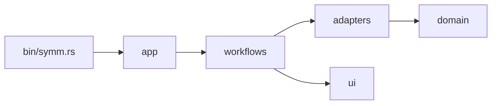
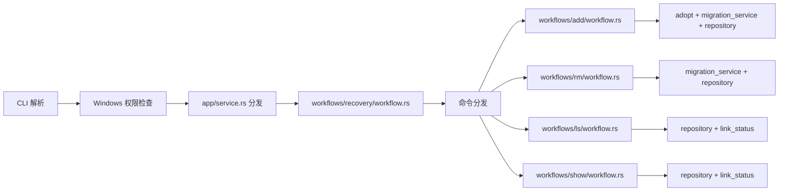
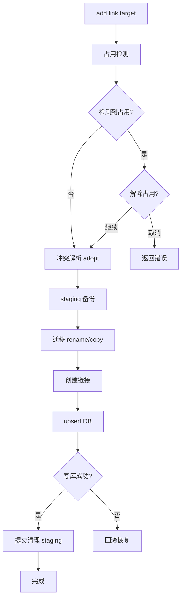
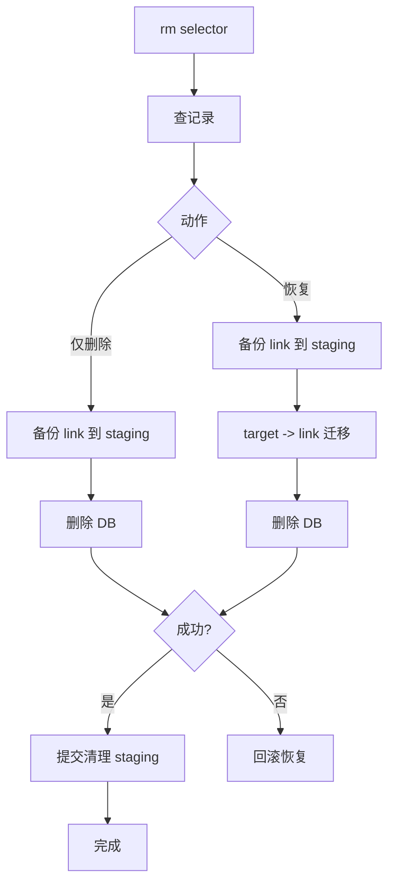

# symm

高性能、跨平台的软链接管理命令行工具。

## 项目介绍

- 管理软链接生命周期：创建、更新、查看、删除
- `add` 支持冲突分支处理、占用探测、事务回滚
- `rm` 支持“仅删除”或“恢复 target 到 link”两种模式
- 跨平台支持 Linux / macOS / Windows（Windows 目录支持 junction 回退）
- 持久化使用 SQLite，按 `link_path` 幂等 upsert

## 快速开始

### 1) 前置依赖

- Rust stable（建议通过 `rustup` 安装，含 `cargo`）
- Git
- 平台：
  - Windows 11
  - Linux
  - macOS
- Windows 本地构建额外需要：
  - Visual Studio Build Tools（或 Visual Studio）中的 C++ 构建工具链（提供 `link.exe`）

### 2) 构建

- `cargo build --release`

### 3) 常用命令

- 添加或纳管链接：`symm add <link> <target>`
- 查看全部：`symm ls`
- 查看单条：`symm show <name|link>`
- 删除记录与链接：`symm rm <name|link>`

### 4) 测试与质量检查

- 本地最小检查：`cargo fmt --all -- --check`
- 本项目以 GitHub Actions CI 作为最终验证门禁（本机缺少 `link.exe` 时不要求本地 `clippy/test`）

## 命令说明

- `symm add <link> <target>`：创建/更新软链接（按 link 幂等）
- `symm rm <name|link>`：删除记录；支持可选恢复 `target -> link`
- `symm ls [--status ok|broken|missing] [--json] [--limit N] [--offset N]`：列表查看（支持分页）
- `symm show <name|link> [--json]`：查看单条详情

## 数据目录

- 默认目录：可执行文件同级的 `data/` 目录
- 可通过 `SYMM_HOME` 覆盖
- 注册库文件：`symm.db`

## 当前架构（分层 + 单一职责）

```text
src/
  bin/
    symm.rs                     # CLI 入口
  app/
    service.rs                  # 命令分发
  domain/
    error.rs                    # 领域错误
    model.rs                    # 领域模型
  workflows/
    add/
      workflow.rs               # add 业务编排
      adopt.rs                  # add 冲突策略与回滚准备
    lifecycle/
      operation_tracker.rs      # add/rm 共享操作日志跟踪
    ls/
      workflow.rs               # ls 业务编排
    recovery/
      workflow.rs               # 启动恢复扫描与分级恢复
    rm/
      workflow.rs               # rm 业务编排
    show/
      workflow.rs               # show 业务编排
  adapters/
    db/repository.rs            # SQLite 读写
    fs/                         # 链接/迁移/ACL/路径操作
    paths/                      # 目录与路径规范化
    platform/admin.rs           # 平台权限能力
    processes/                  # 占用探测与进程终止
    errors/io_map.rs            # IO 错误映射
  ui/
    cli.rs                      # 参数模型
    output.rs                   # 输出渲染
    interaction/choice.rs       # 交互与 env 选择
    progress/migration_reporter.rs
```

### 依赖方向

先区分两种关系：

- 编译期依赖：代码 `use` 的方向
- 运行期调用：一次命令执行时的调用链

下面这张图仅表示“编译期依赖”。



### 运行主流程

下面这张图仅表示“运行期调用链”（不是模块依赖图）。



如果只看最简主链，可以按下面理解：

```text
bin/symm.rs
  -> app/service.rs
    -> workflows/*/workflow.rs
      -> adapters/* + ui/*
```

## 平台行为

- Linux/macOS：使用系统软链接
- Windows：优先创建软链接；目录软链接失败时自动降级为 junction
- Windows：程序要求管理员权限运行（UAC），用于稳定处理链接与占用场景

## `add` 行为与冲突处理

当执行 `symm add <link> <target>` 时：

- 以 `link` 为主键：同一 `link` 重复执行会更新原记录（不是新增）
- 成功后会提示可选填写 `name`：
  - 新增时默认空
  - 更新时默认显示原值，回车保持原样
- 若 `target` 不存在且 `link` 为实体（非软链接）：执行接管迁移（将 `link` 实体迁移到 `target`，再在 `link` 创建指向 `target` 的链接）
  - 同盘时优先快速移动（`rename`），通常几乎瞬时完成
  - 跨盘时自动改为复制到 `target` 后删除源路径
  - 迁移期间会持续输出阶段状态；跨盘复制时会显示已复制大小进度
- 若 `target` 与 `link` 都存在：进入三选一交互
  - 保留 `link`（放弃 `target`）
  - 保留 `target`（放弃 `link`）
  - 取消
- 若 `target` 与 `link` 都存在且 `link` 已是软链接：
  - 若已指向 `target`：直接纳入/更新数据库记录（不再做冲突选择）
  - 若指向其他位置：可选择改为指向新的 `target` 或取消
- 若 `target` 与 `link` 都不存在：返回错误，不自动创建空目标

以上流程采用 staging + 回滚机制，任一步失败会恢复到操作前状态，避免部分成功导致的数据破坏。

## 启动恢复与分级策略

- 每次命令执行前会先扫描 `operations` 中的 pending 操作
- 低风险步骤（`db_write/finalize`）自动标记为 failed，并提示直接重试命令
- 高风险步骤（`staging/migrate/link_change`）要求用户确认（或通过 `SYMM_RECOVERY_HIGH_RISK=confirm|skip` 控制）
- 当前版本高风险恢复不自动执行文件级破坏性动作，确认后会标记为 failed 并提示人工恢复步骤

### `add` 执行流程图



## `rm` 行为与恢复分支

当执行 `symm rm <name|link>` 时：

- 先按 `name` 或 `link_path` 读取记录
- 交互选择后续动作（支持环境变量 `SYMM_RM_ACTION`）：
  - `no/delete`：仅删除软链接并删除数据库记录
  - `yes/restore`：将 `target` 恢复回 `link` 路径后，再删除数据库记录
- 与 `add` 一样使用 staging + 回滚：DB 删除失败或迁移失败会恢复文件系统状态

### `rm` 执行流程图



## 打包与发布（多平台）

### Windows

- 构建：`cargo build --release`
- 产物：`target/release/symm.exe`
- 分发：复制 `symm.exe` 到任意目录
- 建议：将该目录加入 `PATH`，可在任意终端直接执行 `symm`

### Linux

- 构建：`cargo build --release`
- 产物：`target/release/symm`
- 可选安装：
  - `install -m 755 target/release/symm /usr/local/bin/symm`
  - 或复制到 `~/.local/bin` 并确保该目录在 `PATH`

### macOS

- 构建：`cargo build --release`
- 产物：`target/release/symm`
- 可选安装：
  - `install -m 755 target/release/symm /usr/local/bin/symm`
  - 或复制到 `~/.local/bin` 并确保该目录在 `PATH`

### 跨平台交叉编译示例（可选）

- 安装目标：`rustup target add x86_64-unknown-linux-gnu aarch64-apple-darwin x86_64-pc-windows-msvc`
- 构建指定目标：
  - `cargo build --release --target x86_64-unknown-linux-gnu`
  - `cargo build --release --target aarch64-apple-darwin`
  - `cargo build --release --target x86_64-pc-windows-msvc`

## 性能说明（当前实现）

- `ls` 与 `show` 走 SQLite 索引查询，不做目录递归扫描
- `ls`（表格与 `--json`）采用流式输出，并支持 `--limit/--offset` 分页查询，降低大结果集扫描成本
- 可通过 `SYMM_PERF_LOG=1` 开启 `ls/show` 时延日志（输出到 stderr，前缀 `[symm-perf]`）
- 状态计算基于 `symlink_metadata` 与目标存在性判定，避免断链误判
- `add` 接管迁移时：
  - 同盘路径优先 `rename`，保留最快路径
  - 跨盘路径使用带进度回调的复制流程，避免终端长时间无反馈
- `rm` 恢复分支复用同一迁移能力（同盘 rename / 跨盘 copy+delete），并沿用 staging 回滚
- SQLite 连接默认启用：
  - `busy_timeout=5000`
  - `journal_mode=WAL`
  - `synchronous=NORMAL`
  - `temp_store=MEMORY`

### 基线采样（可复现）

- PowerShell：`./scripts/perf-baseline.ps1 -Limit 1000 -Offset 0 -Selector "<name|link>"`
- 输出位置：stderr（`[symm-perf] event=... elapsed_ms=...`）

## GitHub Actions

- `CI`（`.github/workflows/ci.yml`）
  - 触发：`push` 与 `pull_request`
  - 在 Linux / Windows / macOS 执行：
    - `cargo fmt --all -- --check`
    - `cargo clippy --all-targets --all-features -- -D warnings`
    - `cargo test --all-targets`
- `Release`（`.github/workflows/release.yml`）
  - 触发：推送 tag（如 `v0.2.0-test13` 或 `v1.0.0`）
  - 自动构建并上传 release 二进制（测试 tag 仅发布 Windows 产物，稳定 tag 发布多平台产物）
