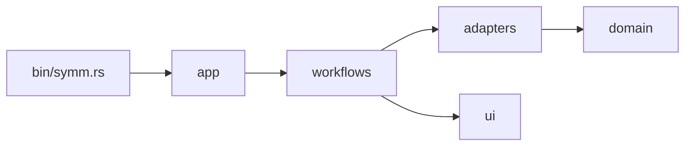
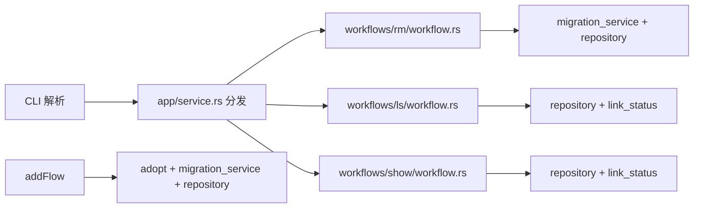
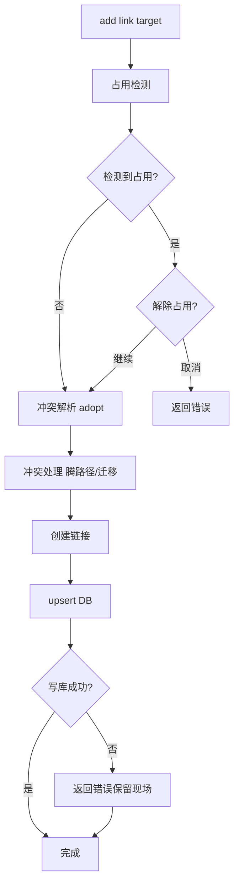
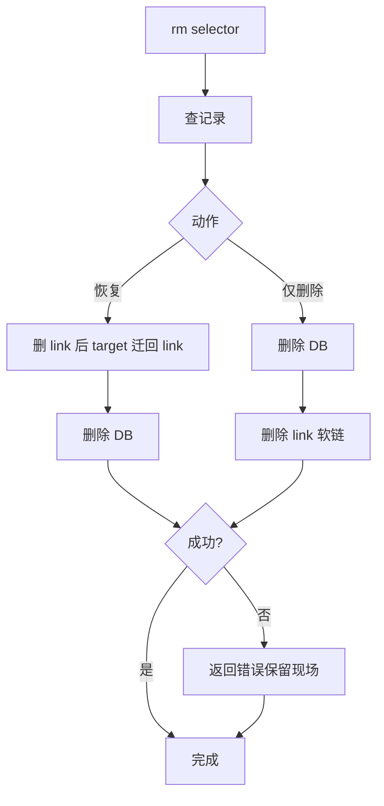

# symm

高性能、跨平台的软链接管理命令行工具。

## 项目介绍

- 管理软链接生命周期：创建、更新、查看、删除
- `add` 支持冲突分支处理、占用探测；失败保留现场由人工处理
- `rm` 支持“仅删除”或“恢复 target 到 link”两种模式
- 跨平台支持 Linux / macOS / Windows（Windows 目录支持 junction 回退）
- 持久化使用 SQLite，按 `link_path` 幂等 upsert

## 快速开始

### 1) 前置依赖

- Rust stable（建议通过 `rustup` 安装，含 `cargo`）
- Git
- 平台：
  - Windows 11
  - Linux
  - macOS
- Windows 本地构建额外需要：
  - Visual Studio Build Tools（或 Visual Studio）中的 C++ 构建工具链（提供 `link.exe`）

### 2) 构建

- `cargo build --release`

### 3) 常用命令

- 添加或纳管链接：`symm add <link> <target>`
- 查看全部：`symm ls`
- 查看单条：`symm show <name|link>`
- 删除记录与链接：`symm rm <name|link>`

### 4) 测试与质量检查

- 本地最小检查：`cargo fmt --all -- --check`
- 本项目以 GitHub Actions CI 作为最终验证门禁（本机缺少 `link.exe` 时不要求本地 `clippy/test`）

## 命令说明

- `symm add <link> <target>`：创建/更新软链接（按 link 幂等）
- `symm rm <name|link>`：删除记录；支持可选恢复 `target -> link`
- `symm ls [--status ok|broken|missing] [--json] [--limit N] [--offset N]`：列表查看（支持分页）
- `symm show <name|link> [--json]`：查看单条详情

## 数据目录

- 默认目录：可执行文件同级的 `data/` 目录
- 可通过 `SYMM_HOME` 覆盖
- 注册库文件：`symm.db`

## 当前架构（分层 + 平台边界）

```text
src/
  bin/symm.rs                   # CLI 入口（含 Windows 按需提权子命令）
  app/service.rs                # 命令分发
  domain/                       # 模型与错误（无平台分支）
  workflows/                    # add / rm / ls / show 编排
  adapters/
    platform/                   # OS API（静态分发，无 dyn）
      privilege.rs / elevate.rs # 是否已提升、按需 UAC（Windows）
      fs/                       # PlatformFs（链接、同卷、迁移、ACL）
      process/                  # 占用检测、结束进程（直调 OS）
    lock/                       # 查锁/杀进程编排（提权子进程、快照）
    fs/                         # 迁移 / rebase / link 策略（无 #[cfg]）
      link.rs / link_windows.rs # 建链入口；Windows 按需 UAC
      migration_service.rs      # migrate、同卷判断
      rebase.rs                 # 软链接路径 rebase
      tree_copy.rs              # 跨盘目录复制 + 进度
    db/ paths/ errors/
  ui/                           # CLI、进度、交互
```

### 平台层约定

- 业务与 workflow **不**写 `#[cfg(windows)]`；平台差异只在 `adapters/platform/**`。
- 文件系统入口：`adapters::platform::fs_platform()`（`PlatformFs` trait）。
- 进程占用入口：`adapters::lock::{list_locking_processes_with_progress, kill_processes}`。
- 建链入口：`adapters::fs::link::{create_link, write_symlink}`。
- Linux / macOS / Windows 共用同一套 `add` / `rm` 流程，仅底层钩子不同。

### 依赖方向

先区分两种关系：

- 编译期依赖：代码 `use` 的方向
- 运行期调用：一次命令执行时的调用链

下面这张图仅表示“编译期依赖”。



### 运行主流程

下面这张图仅表示“运行期调用链”（不是模块依赖图）。



如果只看最简主链，可以按下面理解：

```text
bin/symm.rs
  -> app/service.rs
    -> workflows/*/workflow.rs
      -> adapters/* + ui/*
```

## 平台行为

- Linux/macOS：使用系统软链接；同卷用 `dev` 判断是否可 `rename` 快速迁移
- Windows：优先创建软链接；目录软链接失败时自动降级为 junction；同卷用盘符判断
- Windows：**默认以当前用户运行**；**查占用 / 结束占用** 会通过 UAC 以管理员扫描与杀进程，避免遗漏高权限占用；创建软链接失败时按需 UAC。建议开启「开发者模式」以减少建链提权
- Linux/macOS：**查占用 / 结束占用** 在非 root 时通过 `sudo` 执行同等提权子命令
- Windows：跨盘复制目录时可保存/恢复 ACL（`icacls`，失败时降级为不恢复）
- Windows：`rename` 软链接若遇拒绝访问（os error 5），会重建链接完成迁移

### 迁移与软链接 rebase

- **同盘目录/文件**：`rename` 到 `target`，再对 `target` 树做单遍 rebase（树内绝对路径软链接改指向新根）
- **跨盘**：单遍复制，进度为已复制字节与已处理文件数；复制时对树内软链接做 rebase
- **相对路径**软链接：通常无需改写；**指向树外**的链接保持原目标不变

## `add` 行为与冲突处理

当执行 `symm add <link> <target>` 时：

- 以 `link` 为主键：同一 `link` 重复执行会更新原记录（不是新增）
- 成功后会提示可选填写 `name`：
  - 新增时默认空
  - 更新时默认显示原值，回车保持原样
- 若 `target` 不存在且 `link` 为实体（非软链接）：执行接管迁移（将 `link` 实体迁移到 `target`，再在 `link` 创建指向 `target` 的链接）
  - 同盘时优先快速移动（`rename`），通常几乎瞬时完成
  - 跨盘时自动改为复制到 `target` 后删除源路径（单遍复制，进度为已复制字节与已处理文件数）
  - 迁移期间会持续输出阶段状态
- 若 `target` 与 `link` 都存在：进入三选一交互
  - 保留 `link`（放弃 `target`）
  - 保留 `target`（放弃 `link`）
  - 取消
- 若 `target` 与 `link` 都存在且 `link` 已是软链接：
  - 若已指向 `target`：直接纳入/更新数据库记录（不再做冲突选择）
  - 若指向其他位置：可选择改为指向新的 `target` 或取消
- 若 `target` 与 `link` 都不存在：返回错误，不自动创建空目标

任一步失败即返回错误并停止；中间态由人工处理后再次执行命令。

### `add` 执行流程图



## `rm` 行为与恢复分支

当执行 `symm rm <name|link>` 时：

- 先按 `name` 或 `link_path` 读取记录
- 交互选择后续动作（支持环境变量 `SYMM_RM_ACTION`）：
  - `no/delete`：仅删除软链接并删除数据库记录
  - `yes/restore`：将 `target` 恢复回 `link` 路径后，再删除数据库记录
- 失败时返回错误并保留现场，由人工处理后重试

### `rm` 执行流程图



## 打包与发布（多平台）

### Windows

- 构建：`cargo build --release`
- 产物：`target/release/symm.exe`
- 分发：复制 `symm.exe` 到任意目录
- 建议：将该目录加入 `PATH`，可在任意终端直接执行 `symm`

### Linux

- 构建：`cargo build --release`
- 产物：`target/release/symm`
- 可选安装：
  - `install -m 755 target/release/symm /usr/local/bin/symm`
  - 或复制到 `~/.local/bin` 并确保该目录在 `PATH`

### macOS

- 构建：`cargo build --release`
- 产物：`target/release/symm`
- 可选安装：
  - `install -m 755 target/release/symm /usr/local/bin/symm`
  - 或复制到 `~/.local/bin` 并确保该目录在 `PATH`

### 跨平台交叉编译示例（可选）

- 安装目标：`rustup target add x86_64-unknown-linux-gnu aarch64-apple-darwin x86_64-pc-windows-msvc`
- 构建指定目标：
  - `cargo build --release --target x86_64-unknown-linux-gnu`
  - `cargo build --release --target aarch64-apple-darwin`
  - `cargo build --release --target x86_64-pc-windows-msvc`

## 性能说明（当前实现）

- `ls` 与 `show` 走 SQLite 索引查询，不做目录递归扫描
- `ls`（表格与 `--json`）采用流式输出，并支持 `--limit/--offset` 分页查询，降低大结果集扫描成本
- 可通过 `SYMM_PERF_LOG=1` 开启 `add/rm/ls/show` 时延日志（输出到 stderr，前缀 `[symm-perf]`）
- 状态计算基于 `symlink_metadata` 与目标存在性判定，避免断链误判
- `add` 接管迁移时：
  - 同盘路径优先 `rename`，保留最快路径
  - 跨盘路径使用带进度回调的复制流程，避免终端长时间无反馈
- `rm` 恢复分支复用同一迁移能力（同盘 rename / 跨盘 copy+delete）
- SQLite 连接默认启用：
  - `busy_timeout=5000`
  - `journal_mode=WAL`
  - `synchronous=NORMAL`
  - `temp_store=MEMORY`

本地调试时延日志：设置 `SYMM_PERF_LOG=1`，stderr 输出 `[symm-perf] event=... elapsed_ms=...`。

## GitHub Actions

仅保留两条流水线，作为测试与发布的唯一门禁：

- **CI**（`.github/workflows/ci.yml`）
  - 触发：`push` / `pull_request`（`src/`、`tests/`、`Cargo.*`、本 workflow）
  - 矩阵：ubuntu / windows / macos
  - 步骤：`cargo fmt --check` → `clippy -D warnings` → `cargo test --all-targets`
- **Release**（`.github/workflows/release.yml`）
  - 触发：推送 `v*` tag
  - 构建 release 二进制并上传到 GitHub Release（`-test` tag 仅 Windows 预发布；正式 tag 三平台）
