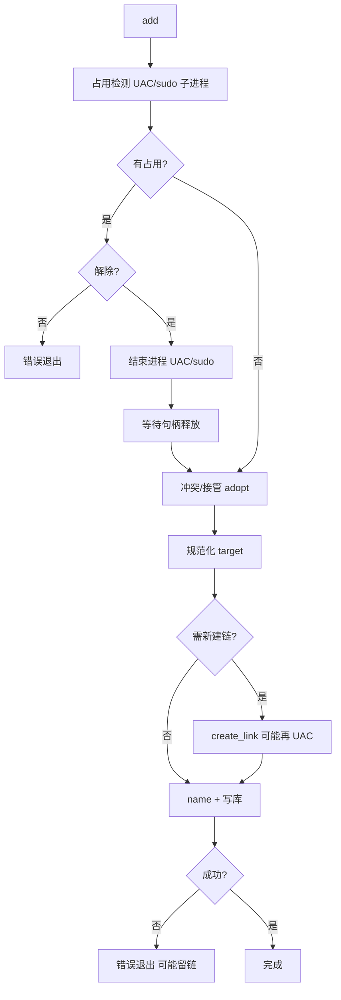
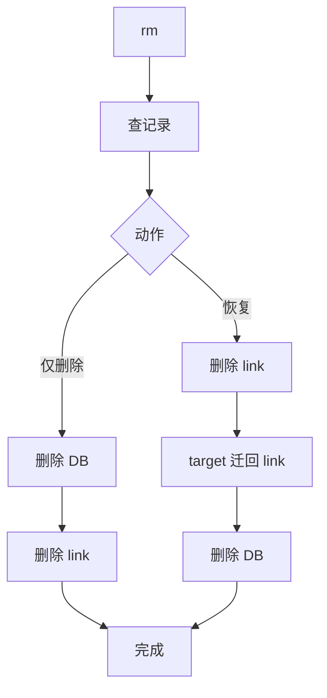

# symm

跨平台软链接管理 CLI：创建、纳管、查看、删除；SQLite 按 `link_path` 幂等 upsert。

## 功能概览

- **`add`**：建链或纳管已有软链；`link` 为实体时可接管迁移到 `target`；冲突与占用可交互处理
- **`rm`**：删除记录与软链，或先将 `target` 迁回 `link` 再删库
- **`ls` / `show`**：列表与详情，支持状态过滤、JSON、分页
- **跨平台**：Linux / macOS / Windows（Windows 目录链失败时可降级为 junction）

失败不自动回滚；任一步出错即停止，中间态由人工处理后重试。

## 快速开始

### 依赖

- Rust stable（`rustup` + `cargo`）
- Git
- Windows 本地构建另需：MSVC 工具链（`link.exe`）

### 构建与运行

```bash
cargo build --release
# 产物：target/release/symm（Windows 为 symm.exe）
```

### 常用命令

```bash
symm add <link> <target>
symm ls [--status ok|broken|missing] [--json] [--limit N] [--offset N]
symm show <name|link> [--json]
symm rm <name|link>
```

### 质量检查

- 本地：`cargo fmt --all -- --check`（或 `mise run fmt-check`）
- 门禁：**GitHub Actions** 三端矩阵（`fmt` → `clippy -D warnings` → `test`）；不以本地构建结果为发布依据

## 数据目录

- **默认**：可执行文件同级 `data/`，库文件为 `symm.db`（仅 `links` 表）
- **覆盖**：设置 `SYMM_HOME` 指向其它目录（见下文）

## 环境变量

默认情况下，`add` / `rm` 在需要你做决定时会弹出**终端菜单**（↑↓ 移动、Enter 确认、Esc 取消）。下列变量用于**跳过对应菜单**，适合脚本、自动化或你已明确意图的场景。

若设置了变量但取值不合法，命令会直接报错退出（不会静默回退到菜单）。

---

### `SYMM_HOME`

指定 symm **存放数据库的目录**（目录下会有 `symm.db`）。

- **默认**：可执行文件所在目录下的 `data/`
- **注意**：不同 `SYMM_HOME` 对应不同的链接库，互不影响

```bash
SYMM_HOME=/var/lib/symm symm ls
```

---

### `SYMM_ADD_NAME`

在 `symm add` 成功建链/纳管之后、写入数据库之前，跳过「可选填写 name」的输入框。

- `name` 是给人看的别名（如 `symm show demo`、`symm rm demo`），可留空；**非空** `name` 在库内必须唯一
- 更新已有 `link` 时若不设置此变量，提示框会默认带上原来的 `name`，回车即可保持不变

```bash
SYMM_ADD_NAME=my-project symm add ./link ./target
```

---

### `SYMM_ADD_LOCK_CHOICE`

在 `add` 时发现 **link 路径**被其它进程占用时，代替「是否结束占用并继续」的菜单。

| 取值 | 效果 |
| :--- | :--- |
| `unlock`（`kill`、`continue`） | 结束占用进程，等待句柄释放后继续 `add` |
| `cancel`（`abort`） | 不杀进程，取消本次 `add` |

```bash
SYMM_ADD_LOCK_CHOICE=unlock symm add ./busy-link ./target
```

---

### `SYMM_ADD_CONFLICT_CHOICE`

在 `add` 时 **link 与 target 都已存在**，且 link **不是**软链接（两个实体冲突）时，代替「保留哪一边」的菜单。

| 取值 | 效果 |
| :--- | :--- |
| `link`（`keep_link`） | 保留 link 内容：删 target，把 link 迁到 target，再在 link 建链 |
| `target`（`keep_target`） | 保留 target：删 link，再在 link 新建指向 target 的软链 |
| `cancel` | 不修改，退出 |

---

### `SYMM_ADD_SYMLINK_CONFLICT_CHOICE`

在 `add` 时 link **已是软链接**，但指向与本次 `target` **不一致**时，代替「是否改指向新 target」的菜单。

| 取值 | 效果 |
| :--- | :--- |
| `retarget`（`target`、`replace`） | 删除旧软链，随后创建指向新 target 的链接 |
| `cancel` | 不修改软链，退出 |

若软链已指向本次 `target`，不会出现此菜单，只更新数据库。

---

### `SYMM_RM_ACTION`

在 `symm rm` 查到记录之后，代替「是否将 target 恢复到 link 位置」的菜单。

| 取值 | 效果 |
| :--- | :--- |
| `delete` / `no` / `n` | **仅删除**：先删库记录，再删 link 软链；target 仍留在原处 |
| `restore` / `yes` / `y` | **恢复再删库**：删软链 → 将 target 迁回 link → 删库记录 |

```bash
SYMM_RM_ACTION=delete symm rm my-link
```

---

### `SYMM_PERF_LOG`

调试时在 **stderr** 输出各命令耗时（前缀 `[symm-perf]`），不影响命令结果。设为 `1` 或非 `0`/`false`/`no` 的值即开启。

```bash
SYMM_PERF_LOG=1 symm ls
```

## 平台差异

| 能力 | Linux / macOS | Windows |
|------|---------------|---------|
| 建链 | `symlink` | 软链；目录失败可 junction |
| 同盘判断 | `dev` | 盘符 |
| 查占用 | `fuser` / `lsof`；非 root 时 **sudo 子进程** | **Restart Manager**；非管理员时 **UAC 子进程**（按迁移目录**全文件清单**注册） |
| 杀占用进程 | 同上（sudo 子进程） | UAC 子进程 + `TerminateProcess` |
| 建链提权 | 无 | 仅当普通建链失败且错误需提权时 UAC |
| 跨盘目录 ACL | — | `icacls` 快照（失败则跳过恢复） |
| 同盘迁移软链 | `rename` + 树内 rebase | `rename`；拒绝访问时重建链接 |

交互式终端下 Linux/macOS 的 `sudo` 可正常输入密码；无 TTY 的自动化场景可能失败。

### Windows：占用检测与提权（实现说明）

- **主进程**（你运行的 `symm`）保持**当前用户**，迁移/复制/写库不在此提权。
- **查占用 / 杀进程**：非管理员时通过 [`runas`](https://crates.io/crates/runas) 启动**独立子进程**（`symm __elevated-list-locks` / `__elevated-kill`），UAC 点「是」后子进程内执行 Restart Manager 或结束进程；结果经临时快照文件回传主进程。子进程**不弹黑窗**（`show(false)`），扫锁进度经临时文件回传并在**主终端**输出。
- **扫锁范围**：对 `link` 路径做与迁移一致的 `WalkDir` 收集**普通文件**（不注册目录本身；目录无 `\` 结尾会导致 `RmGetList` 错误 5），分批 `RmRegisterResources` / `RmGetList`；单批若遇 `ACCESS_DENIED` 会二分拆分跳过不可查路径。
- **提权失败**：直接报错（含 `--elevated-log` 路径下的子进程日志）；**不会**再在主进程用普通权限重扫一遍。
- **杀进程后**：短暂等待句柄释放（约 0.8s），**不再**反复扫锁或二次 UAC。
- **已是管理员终端**：本进程直接调 RM / 杀进程，不启 UAC 子进程。
- **建链**：仍为先普通用户创建；仅权限不足时再 UAC（`__elevated-create-link`），与扫锁策略不同。

## 迁移与 rebase

- **同盘**：`rename` 到目标路径，再对目标树单遍 rebase（树内**绝对路径**软链改指向新根）
- **跨盘**：单遍复制；进度为**已复制字节**与**已处理文件数**；复制时对树内软链 rebase
- **相对路径**软链：通常不改写；指向树外的链接保持原目标
- **跨盘删源失败**：目标已存在，源可能仍在，需人工清理（错误信息会说明）

> **注意**：占用扫描只能发现「有进程注册在 RM 的资源」；迁移阶段仍可能遇到文件锁（`os error 33`），需完全退出相关程序（含托盘/后台）后重试。

## `add` 流程

执行顺序：**占用检测** → **冲突/接管（adopt）** → **规范化 target** → **建链（若需要）** → **填写 name** → **写库**。

| 场景 | 行为 |
|------|------|
| 同一 `link` 再次执行 | 更新原记录（`ON CONFLICT(link_path)`），非新增行 |
| `link` 占用 | UAC/sudo 扫锁 → 可选结束占用 → 等待句柄释放 → 继续；取消则退出 |
| `link` 为实体且 `target` 不存在 | 将 `link` 迁移到 `target`，再建链指向 `target` |
| `link` 与 `target` 均存在（link 非软链） | 三选一：保留 link / 保留 target / 取消 |
| `link` 已是软链且指向 `target` | 跳过建链，仅更新库 |
| `link` 已是软链但指向别处 | 改指向新 target 或取消 |
| `link`、`target` 均不存在 | 在规范化 target 时报错（不创建空 target） |
| 写库失败 | 可能已创建软链但无库记录，需人工对齐 |



## `rm` 流程

先按 **name** 或 **link_path** 查记录，再选动作：

| 动作 | 顺序 |
|------|------|
| **仅删除**（`delete` / `no`） | 先删库 → 再删 `link` 软链 |
| **恢复**（`restore` / `yes`） | 先删 `link` → `target` 迁回 `link` → 再删库 |

恢复分支复用与 `add` 相同的迁移能力（同盘 rename / 跨盘复制）。



## 代码结构

```text
src/
  bin/symm.rs              # CLI；内部提权子命令（__elevated-*）
  app/service.rs           # 命令分发
  domain/                  # 模型与错误
  workflows/               # add / rm / ls / show（无平台 cfg）
  adapters/
    platform/
      fs/                  # 建链、迁移、ACL、同盘判断
      process/
        restart_manager.rs # Windows：Restart Manager 扫锁
        windows.rs         # Windows：杀进程、进程路径
        unix.rs            # Unix：fuser / lsof
      privilege.rs         # runas / sudo 提权子进程
    lock/                  # 占用编排、UAC 快照协议、提示文案
    fs/                    # 迁移、rebase、建链策略（link_windows）
    db/ paths/
  ui/                      # 交互、进度输出
```

约定（**修改代码必须遵守**；Agent 见 `.cursor/rules/architecture-layers.mdc`）：

- `workflows/**`、`adapters/fs/**`（除既有 `link_windows` 等封装）不写 `#[cfg(windows)]` / `#[cfg(unix)]`，不直接 `use adapters::platform::*`
- 平台 API、`cfg` 分支、UAC/占用相关文案 → `adapters/platform/**` 或 `adapters/lock/**`（如 `lock/messages.rs`）
- `workflows` 只编排流程，通过 adapters 对外入口调用

对外入口示例：

- 文件系统：`adapters::platform::fs_platform()`（`PlatformFs`）
- 占用：`adapters::lock::list_locking_processes_with_progress` / `kill_processes`
- 建链：`adapters::fs::link::create_link`

## 实现要点

- `ls` / `show`：只查 SQLite，不扫盘；`ls` 支持流式输出与 `--limit` / `--offset`
- 链状态：`symlink_metadata(link)` 不存在 → `missing`；存在但 `target` 不存在 → `broken`
- SQLite：`busy_timeout=5000`、`WAL`、`synchronous=NORMAL`、`temp_store=MEMORY`
- 非空 `name` 在库内唯一（空 name 允许多条）
- Windows 依赖：`windows`（Restart Manager）、`runas`（UAC 子进程）；已移除 `filelocksmith`

## 打包与发布

各平台：`cargo build --release`，产物在 `target/release/`。

可选安装：`install -m 755 target/release/symm /usr/local/bin/symm`（或 `~/.local/bin`）。

交叉编译示例：

```bash
rustup target add x86_64-unknown-linux-gnu aarch64-apple-darwin x86_64-pc-windows-msvc
cargo build --release --target <triple>
```

## GitHub Actions

| Workflow | 触发 | 说明 |
|----------|------|------|
| **CI** | `push` / `PR`（`src/`、`tests/`、`Cargo.*`、workflow） | ubuntu / windows / macos：`fmt` → `clippy -D warnings` → `test` |
| **Release** | 推送 `vX.Y.Z`（无 `-` 后缀） | 正式发布，三平台，设为 Latest |
| **Release Test** | 推送 `vX.Y.Z-test[-平台]` 或手动触发 | 测试 Pre-release，**不**取代 Latest；可只打指定平台（见下） |

**Release Test 平台与版本**（正式 `release.yml` 仍固定三端全打）：

- Tag：`vX.Y.Z-test`（三端）、`vX.Y.Z-test-windows` / `-test-linux` / `-test-macos`，或多平台如 `vX.Y.Z-test-windows-linux`（`win` / `mac` 别名）。**勿**在 `test` 后加数字（不用 `v0.1.0-test15`）。
- 版本号只改 `X.Y.Z`：小改动 `Z+1`（`0.1.0→0.1.1`）；大变动 `Y+1` 且 `Z=0`（`0.1.2→0.2.0`）。
- 手动：`gh workflow run release-test.yml -f build_windows=true -f build_linux=false -f build_macos=false`

**打包与 CI**：`release*.yml` 只做 `cargo build --release`，**不重复**跑测试；会先查当前 commit 上 `ci.yml` 三端矩阵是否已成功。请先 push 并等 CI 全绿再打 tag，否则会失败并提示缺少/未通过的 CI 运行。

**Release 说明**：自动使用 **tag 所指向 commit 的提交说明**（`git log -1`）作为 GitHub Release 正文。打 tag 前把该 commit 的 message 写好即可；跨多 commit 时可在打 tag 前 `git commit --amend` 汇总，或 squash 后再 tag。手动触发测试包时可用 `release_notes` 覆盖。